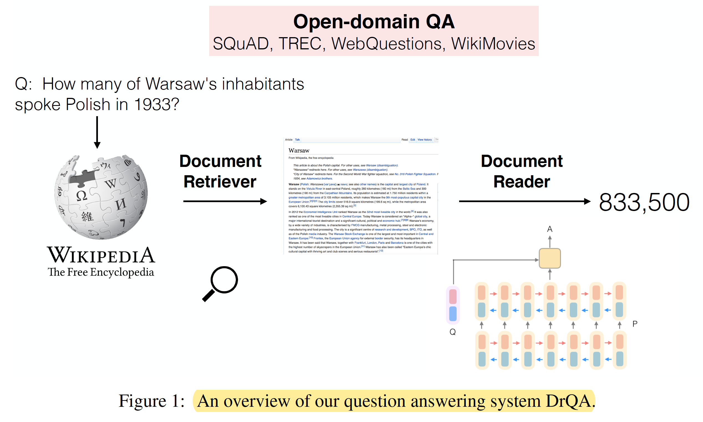

## Reading Wikipedia to Answer Open-Domain Questions

+++++++++++++++++++++++++++++++  
<ins>Authors</ins>: D. Chen et al.  
<ins>Date</ins>: 2017-04  
<ins>Tags</ins>: `tf-idf`, `lstm`     
+++++++++++++++++++++++++++++++  

## Intro

- This paper considers the problem of answering factoid questions in an open-domain setting using Wikipedia as the unique knowledge source.
- Using Wikipedia articles as the knowledge source causes the task of question answering (QA) to combine the challenges of both large-scale open-domain QA and of machine comprehension of text.
- In order to answer any question, one must first retrieve the few relevant articles among more than 5 million items, and then scan them carefully to identify the answer. They term this setting, **machine reading at scale** (MRS).

## Contributions

- They develop DrQA, a strong system for question answering from Wikipedia composed of: 
  1. *Document Retriever*, a module using **bigram hashing** and **TF-IDF** matching designed to, given a question, efficiently return a subset of relevant articles;
  2. *Document Reader*, a multi-layer **recurrent neural network** (RNN) machine comprehension model trained to detect answer spans in those few returned documents.
- Their experiments show that *Document Retriever* outperforms the built-in Wikipedia search engine (ElasticSearch) and that *Document Reader* reaches state-of-the-art results on the very competitive SQuAD benchmark.

***

## 1. Approach

### Document Retriever

- They use an efficient (non-machine learning) document retrieval system to first narrow their search space and focus on reading only articles that are likely to be relevant.
- A simple **inverted index lookup** followed by **term vector model scoring** performs quite well on this task for many question types. Specifically, articles and questions are compared as **TF-IDF** weighted bag-of-word vectors. They further improve their system by taking local word order into account with n-gram features (their best performing system uses bigram counts).
- They use *Document Retriever* as the first part of their full model, by setting it to return 5 Wikipedia articles given any question. Those articles are then processed by *Document Reader*.

### Document Reader

- Given a question *q* consisting of *l* tokens *{q1,...,ql}* and a document or a small set of documents of *n* paragraphs where a single paragraph consists of *m* tokens, they develop an **RNN** model that they apply to each paragraph in turn and then finally aggregate the predicted answers.
- <ins>Paragraph encoding</ins>
  - They first represent all tokens *pi* in a paragraph as a sequence of feature vectors comprised of the following parts:
    - *Word embedding*: 300-dimensional **Glove** word embeddings trained from 840B Web crawl data.
    - *Exact match*: whether *pi* can be exactly matched to one question word in *q*, either in its original, lowercase or lemma form.
    - *Token features*: part-of-speech (POS) and named entity recognition (NER) tags and its (normalized) term frequency (TF).
    - *Aligned question embedding*: word embedding (the Glove ones) weighted with an attention score that captures the similarity between the token *pi* and each question words *qj*.
  - They then pass the sequence of feature vectors as the input to a recurrent neural network which outputs a token representation for each token *pi*. Specifically, they choose to use a multi-layer bidirectional long short-term memory network (LSTM), and take the token representation as the concatenation of each layer’s hidden units in the end.
- <ins>Question encoding</ins>
  - They only apply another recurrent neural network on top of the word embeddings of *qi* and combine the resulting hidden units into one single vector, computed by weighting each word vector with a learned attention score encoding the importance of each question word.
- <ins>Prediction</ins>
  - At the paragraph level, the goal is to predict the span of tokens that is most likely the correct answer.
  - They take the the paragraph vectors and the question vector as input, and simply train two classifiers independently for predicting the two ends of the span (*start* and *end*). Specifically, they compute the probabilities of each token being *start* and *end*.
  - During prediction, they choose the best span from token *i* to token *i'* such that *i <= i' <= i+15* and *Pstart(i) x Pend(i')* is maximized.

## 2. Data

- <ins>Three types of data</ins>
  1. Wikipedia that serves as their knowledge source for finding answers;
  2. the SQuAD dataset which is their main resource to train *Document Reader*;
  3. three more QA datasets (CuratedTREC, WebQuestions and WikiMovies) that in addition to SQuAD, are used to test the open-domain QA abilities of their full system.
- <ins>Distantly Supervised Data</ins>
  - CuratedTREC, WebQuestions and WikiMovies only contain question-answer pairs, and not an associated document or paragraph as in SQuAD, and hence cannot be used for training *Document Reader* directly.
  - Consequently, they use a procedure to automatically associate paragraphs to such training examples, and then add these examples to their training set:
    - First, they run *Document Retriever* on the question to retrieve the top 5 Wikipedia articles.
    - Then are discarded:
      - All paragraphs from those articles without an exact match of the known answer;
      - All paragraphs shorter than 25 or longer than 1500 characters;
      - Any paragraph that does not contain named entities detected in the question.
    - For every remaining paragraph in each retrieved page, they score all positions that match an answer using unigram and bigram overlap between the question and a 20 token window, keeping up to the top 5 paragraphs with the highest overlaps (if there is no paragraph with non-zero overlap, the example is discarded).

## 3. Experiments
- <ins>Finding Relevant Articles</ins>
  - They examine the performance of their *Document Retriever* module on all the QA datasets.
  - Specifically, they compute the ratio of questions for which the text span of any of their associated answers appear in at least one the top 5 relevant pages returned by the system.
  - Results: their simple approach outperforms Wikipedia Search, especially with bigram hashing.
  - They also compare doing retrieval with Okapi **BM25** or by using **cosine distance** in the word embeddings space (by encoding questions and articles as bag-of-embeddings), both of which they find performed worse.
- <ins>Reader Evaluation on SQuAD</ins>
  - Their system (single model) can achieve 70.0% exact match and 79.0% F1 scores on the test set, which surpasses all the published results and can match the top performance on the SQuAD leader board at the time of writing. Additionally, they think that their model is conceptually simpler than most of the existing systems.
  - They also conducted an ablation analysis on the feature vector of paragraph tokens and showed that all the features contribute to the performance of their final system.
- <ins>Full Wikipedia Question Answering</ins>
  - They assess the performance of their full system *DrQA* for answering open-domain questions.
  - They compare three versions of *DrQA* depending on the training sources provided to *Document Reader* (*Document Retriever* remains the same for each case):
    - SQuAD: A single Document Reader model is trained on the SQuAD training set only and used on all evaluation sets;
    - Fine-tune: A Document Reader model is pre-trained on SQuAD and then fine-tuned for each dataset independently using its distant supervision (DS) training set;
    - Multi-task: A single Document Reader model is jointly trained on the SQuAD training set and all the DS sources.
  - Results:
    - The single model trained only on SQuAD is outperformed on all four of the datasets by the multitask model that uses distant supervision.
    - The majority of the improvement from SQuAD to Multitask (DS) however is likely not from task transfer as fine-tuning on each dataset alone using DS also gives improvements, showing that is is the introduction of extra data in the same domain that helps.
